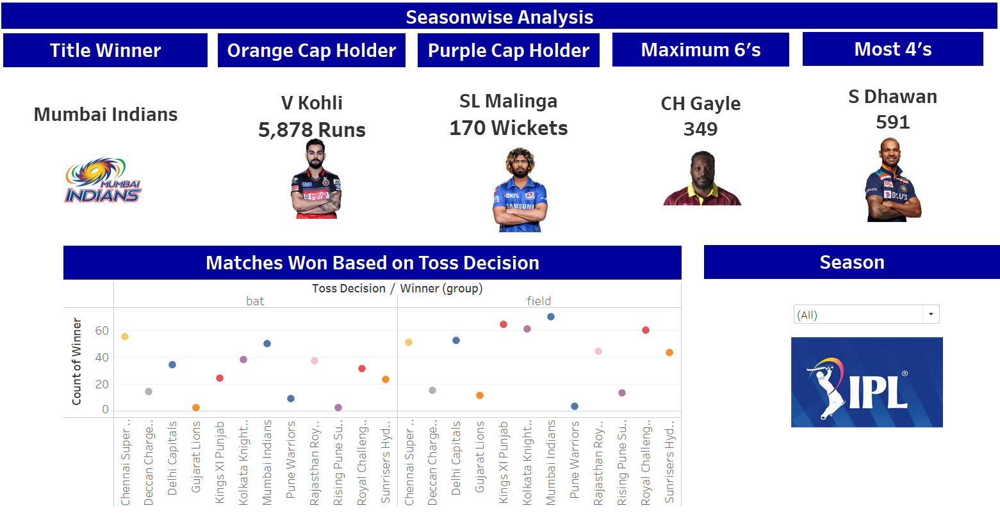

# IPL Data Analysis

This project focuses on analyzing the Indian Premier League (IPL) cricket data to uncover patterns, trends, and insights. The analysis includes exploring team performances, player statistics, match outcomes, and other relevant aspects to provide a comprehensive understanding of the tournament.

## Objectives
- **Understand Key Trends**: Analyze the overall performance of teams and players across multiple IPL seasons.
- **Performance Analysis**: Evaluate the performance metrics of players (batsmen, bowlers) and teams.
- **Match Insights**: Identify factors influencing match outcomes, such as home advantage, toss decision, and player form.
- **Data Visualization**: Use visualizations to present the analysis results for better interpretation and communication.

## Analysis Conducted

1. **Exploratory Data Analysis (EDA):**
- Analyzed team performance across seasons.
- Studied player performance (top batsmen, bowlers).
- Examined match trends such as win percentage, toss decisions, and stadium impact.

2. **Predictive Modeling:**
- Developed models to predict match result using machine learning techniques (Decision Trees).
